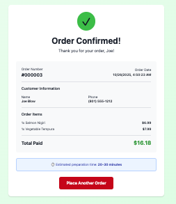
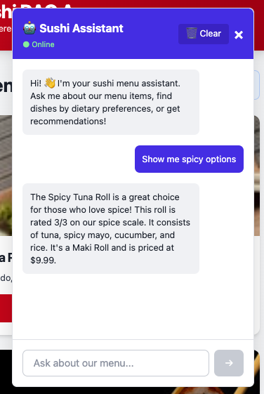
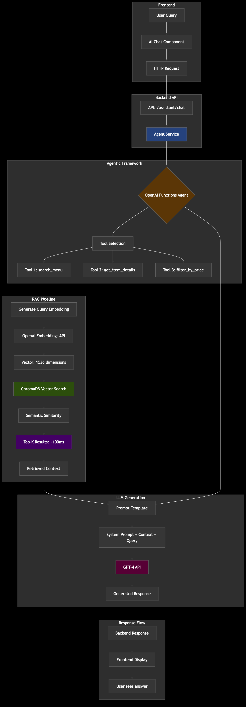

# Sushi RAG App 🍣

A modern food ordering web application with AI-powered menu assistance, featuring React frontend, Node.js backend, and PostgreSQL database.

## Features

- 🍱 Browse sushi menu with beautiful UI
- 🛒 Add items to cart
- 📦 Place orders
- 💾 **Session storage** - customer information retained across orders for quick reordering
- ✨ **Advanced form validation** - onBlur field-level error checking with real-time visual feedback
- 🤖 **AI-powered chat assistant** with RAG and agentic framework
- 🔍 **Semantic search** - find items by description, ingredients, dietary preferences
- 🧠 **Multi-tool AI agent** - autonomous tool selection for complex queries
- 💬 **Conversational interface** - natural language menu recommendations
- 🗄️ **Vector database** - ChromaDB for sub-100ms semantic similarity search
- 🐳 Docker-based development environment
- ✅ Automatic Docker health checks
- ⏱️ Performance monitoring (OpenAI & PostgreSQL query timing)

## Screenshots

<div align="center">

### Browse & Order
<a href="docs/images/0-pre-order.png" target="_blank">
  
</a>

*Browse the menu, add items to cart, and view your order summary (click to enlarge)*

### Order Confirmation
<a href="docs/images/1-order-conf.png" target="_blank">
  
</a>

*Seamless checkout with customer information saved for future orders (click to enlarge)*

### AI Assistant
<a href="docs/images/2-ai-assistant.png" target="_blank">
  
</a>

*Chat with the AI assistant for personalized menu recommendations and semantic search (click to enlarge)*

</div>

## Tech Stack

### Frontend
- React 18
- Vite
- Tailwind CSS
- Axios
- Browser Session Storage (customer data persistence)

### Backend
- Node.js
- Express
- PostgreSQL
- OpenAI API

### Infrastructure
- Docker & Docker Compose
- Concurrently for dev workflow

### AI Stack
- **Vector Database**: ChromaDB for semantic search with cosine similarity
- **Embeddings**: OpenAI text-embedding-3-small (1536 dimensions)
- **RAG Pipeline**: LangChain for context retrieval + generation
- **Agentic Framework**: LangChain OpenAI Functions Agent with custom tools
- **LLM**: GPT-4 for natural language understanding and generation

## Architecture

This application has three main feature areas, each with its own architecture diagram:

1. **RAG System Architecture** - Shows how the AI assistant processes natural language queries
2. **Order Flow Diagram** - Shows how customers place orders
3. **Testing Architecture** - Shows the comprehensive test suite structure (see Testing section below)

### RAG System Architecture

This is the main technical diagram showing the complete AI workflow from user query to response, including vector search and LLM generation.

<div align="center">
  <a href="docs/images/rag-architecture-dark.png" target="_blank">
    
  </a>
  <p><em>Click to open full-size diagram in new window</em></p>
</div>

> **Note**: This diagram shows the RAG architecture with readable text rendering.

#### Creating the Architecture Diagram

The `rag-architecture-dark.png` diagram was created from the Mermaid-generated SVG (`rag-architecture-dark.svg`) using the following process:

1. **Source Files**:
   - `docs/images/rag-architecture-dark.svg` - The source Mermaid SVG diagram
   - `docs/images/view-svg.html` - HTML viewer for rendering the SVG
2. **Conversion Process**:
   - Open the SVG using the HTML viewer in a browser
   - Use browser "Print to PDF" functionality
   - Open the PDF in macOS Preview (shows multiple pages/panes)
   - Remove blank panes and export each visible pane as a separate PNG (e.g., `arch-1.png`, `arch-2.png`, `arch-3.png`)
   - Combine the PNGs using ImageMagick:
     ```bash
     montage arch-1.png arch-2.png arch-3.png -tile 1x3 -geometry +0+0 -background black rag-architecture-dark.png
     ```

**Why This Approach?** Mermaid SVG diagrams with CSS styling are complex. Converting to a multi-page PDF preserves text rendering, and ImageMagick's `montage` command efficiently combines the exported PNGs into a final diagram.

---

### Order Flow with Session Storage

**Note**: This is a separate flow showing the ordering system (menu browsing and checkout), which is independent from the RAG system shown above.

```mermaid
graph TB
    subgraph "User Journey"
        A[Browse Menu] --> B[Add Items to Cart]
        B --> C[View Cart]
        C --> D[Click Place Order]
    end
    
    subgraph "Order Form Component"
        D --> E{Check Session Storage}
        E -->|First Time User| F[Empty Form]
        E -->|Returning User| G[Pre-filled Form]
        G -->|Load from sessionStorage| H[Name, Phone Auto-filled]
        
        F --> I[User Fills Form]
        H --> J[User Verifies Info]
        I --> K[Enter Credit Card]
        J --> K
    end
    
    subgraph "Order Submission"
        K --> L[Submit Order]
        L --> M[POST /api/orders]
        M --> N[PostgreSQL Database]
        N --> O[Order Saved]
    end
    
    subgraph "Session Storage Update"
        O --> P[Save to sessionStorage]
        P --> Q{Save Customer Info}
        Q -->|Save| R[firstName, lastName, phone]
        Q -->|Don't Save| S[creditCard - Security]
        R --> T[sessionStorage.setItem]
    end
    
    subgraph "Next Order"
        T --> U[Order Confirmation]
        U --> V[User Adds More Items]
        V --> D
    end
    
    style E fill:#004080
    style P fill:#004d00
    style S fill:#660033
    style T fill:#663300
```

<details>
<summary>🛒 Order Flow Diagram (click to expand)</summary>



**Key Features:**
- **First Order**: User enters all information (name, phone, credit card)
- **Subsequent Orders**: Name and phone are pre-filled from session storage
- **Security**: Credit card is **never** stored - must be re-entered each time
- **Session Scope**: Data persists only for current browser session (cleared on tab/browser close)
- **Privacy First**: Uses `sessionStorage` instead of `localStorage` for better privacy

</details>

---

### Key Components

**1. Vector Store (ChromaDB)**
- Stores menu items as 1536-dimensional embeddings
- Enables semantic search: "spicy vegetarian options" matches relevant items
- Cosine similarity for relevance ranking
- Sub-100ms query latency

**2. RAG Pipeline**
- **Retrieval**: Query → Embedding → Vector Search → Top-K documents
- **Augmentation**: Inject retrieved context into LLM prompt
- **Generation**: GPT-4 generates response grounded in actual menu data

**3. Agentic Framework**
- **Autonomous Tool Selection**: Agent decides which tools to call
- **Function Calling**: GPT-4 generates structured tool invocations
- **Multi-step Reasoning**: Chains multiple tool calls for complex queries
- **Context Management**: Maintains conversation history

**4. Session Storage for Customer Data**
- **Automatic Persistence**: Customer information (name, phone) saved after first order
- **Quick Reordering**: Pre-fills form for subsequent orders in same session
- **Security by Design**: Credit card never stored - must be re-entered
- **Privacy Conscious**: Uses `sessionStorage` (cleared on browser close) not `localStorage`
- **Implementation**: React `useEffect` hook loads saved data on component mount
- **User Experience**: Seamless repeat ordering without re-entering personal info

**5. Advanced Form Validation**
- **onBlur Validation**: Field-level checking when user exits input (tab or click away)
- **Consolidated Error Messages**: Multiple validation rules combined into single user-friendly message
- **Real-time Visual Feedback**: Invalid fields display red border and error text below input
- **Smart Button Control**: Submit button disabled automatically when any field has errors
- **Validation Rules**:
  - Required fields: name, last name, phone (exactly 10 digits), credit card (13-16 digits)
  - Format checking: phone numbers and credit cards
  - Length constraints with intelligent error messaging
- **User Experience**: Immediate feedback without requiring form submission attempt
- **Implementation**: Custom React validation system with field-level state management

**6. Testing & Quality Assurance**
- **Comprehensive Test Suite**: 66 tests covering backend and frontend (100% pass rate)
- **Backend Validation**: 29 tests for order processing, database errors, edge cases
- **Frontend Validation**: 37 tests for UI, error handling, session storage, onBlur validation
- **Error Code System**: Validates proper error categorization (📝🌐🔧⏱️🔁⚠️)
- **CI/CD Ready**: Automated test execution with Jest and Vitest
- **Coverage**: Success cases, validation errors, database failures, network issues

**7. Example Flow - AI Assistant**

```
User: "Show me spicy vegetarian options under $15"

Step 1: Agent analyzes query
  → Needs: semantic search + price filter

Step 2: Tool Calls
  → search_menu("spicy vegetarian")
  → filter_by_price(15)

Step 3: Vector Search
  → Generate embedding for "spicy vegetarian"
  → ChromaDB returns top 5 matches (~80ms)
  → Filter results by price < $15

Step 4: LLM Response
  → Context: [Spicy Tofu Roll $12, Veggie Tempura $10...]
  → GPT-4 synthesizes natural language response
  → "I found 2 great options for you..."

Total Time: ~2 seconds (including LLM generation)
```

## Quick Start

### Prerequisites

- Node.js 16+ installed
- Docker Desktop installed and running (the app will check automatically)
- OpenAI API key (optional, for AI features)

### Installation

```bash
# Clone the repository
cd /Users/sbecker11/workspace-sushi/sushi-rag-app

# Install all dependencies (root, backend, frontend)
npm run install-all

# Create .env file from template
cp env.example .env

# Set up database (one-time setup)
npm run db:setup

# Start the application - this does everything!
# (kills old processes, starts Docker, checks health, starts servers)
npm run dev
```

The app will be available at:
- **Frontend:** http://localhost:5173
- **Backend API:** http://localhost:3000

### Environment Setup

Create a `.env` file in the **root directory** (not in backend):

```env
# Backend Configuration
PORT=3001

# PostgreSQL Docker Container Configuration
POSTGRES_CONTAINER=sushi-rag-app-postgres
POSTGRES_USER=sushi_rag_user
POSTGRES_PASSWORD=sushi_rag_password
POSTGRES_DB=sushi_rag_orders
POSTGRES_HOST=localhost
POSTGRES_PORT=5432

# OpenAI Configuration (required for AI features)
OPENAI_API_KEY=your_openai_api_key_here

# ChromaDB Configuration (Vector Database)
CHROMA_HOST=localhost
CHROMA_PORT=8000

# Frontend URL (for CORS)
FRONTEND_URL=http://localhost:5173

# Performance Monitoring
# Set to 'true' to enable performance timing logs, 'false' to disable
ENABLE_PERFORMANCE_LOGGING=true
```

You can copy from the example:
```bash
cp env.example .env
# Then edit .env and add your OpenAI API key
```

**Note:** AI features require an OpenAI API key. You can create a new one at <https://platform.openai.com/api-keys>.

## npm Scripts

### Development

```bash
npm run dev          # 🚀 Start everything (kills ports, starts Docker, checks health, runs servers)
npm run server       # Start backend only (also runs prestart checks)
npm run client       # Start frontend only (also runs prestart checks)
npm run prestart     # Run all pre-flight checks (ports, Docker, health)
```

### Docker Management

```bash
npm run docker:up     # Start Docker services
npm run docker:down   # Stop Docker services
npm run docker:reset  # Reset Docker services (removes data)
```

### Database

```bash
npm run db:setup     # Initialize database schema
```

### Utilities

```bash
npm run check:docker        # Full Docker and services health check
npm run check:docker-daemon # Quick check if Docker Desktop is running
npm run cleanup:docker      # Remove old Docker containers
npm run kill:ports          # Kill processes on ports 3001 and 5173
npm run install-all         # Install all dependencies
```

## Automatic Docker Checks

The app includes automatic health checks that run before starting. This prevents confusing errors if Docker isn't running.

### What It Checks

- ✅ Docker Desktop is running
- ✅ Required services (PostgreSQL) are running
- ✅ Services are healthy and ready

### Example Output

**When everything is ready:**
```
========================================
     Docker & Services Check
========================================

🔍 Checking if Docker Desktop is running...
✅ Docker Desktop is running

🔍 Checking required services...
✅ Service "sushi-rag-app-postgres" is running and healthy

✅ All checks passed! Starting application...
```

**When Docker is not running:**
```
❌ Docker Desktop is NOT running!

Please start Docker Desktop and try again.
You can start it by:
  - Opening Docker Desktop from Applications
  - Or running: open -a Docker
```

For more details, see [Docker Workflow Guide](docs/01_DOCKER_WORKFLOW.md)

## Performance Monitoring

The app includes built-in performance monitoring for OpenAI API calls and PostgreSQL queries.

### Configuration

Control performance logging via the `.env` file:

```env
# Enable performance timing logs
ENABLE_PERFORMANCE_LOGGING=true

# Disable performance timing logs (for production)
ENABLE_PERFORMANCE_LOGGING=false
```

### Example Output

**When enabled, you'll see timing metrics in the backend console:**

```
🤖 Calling OpenAI API to generate menu...
⏱️  OpenAI LLM Response Time: 3247ms
✅ Generated menu from OpenAI LLM

⏱️  PostgreSQL: Fetch all orders - 12ms
⏱️  PostgreSQL: Fetch items for 3 orders - 8ms

⏱️  PostgreSQL: BEGIN transaction - 2ms
⏱️  PostgreSQL: INSERT order - 15ms
⏱️  PostgreSQL: INSERT 3 order items - 7ms
⏱️  PostgreSQL: COMMIT transaction - 3ms
⏱️  PostgreSQL: Total transaction time - 27ms
```

### Use Cases

- **Development:** Enable to monitor performance and identify bottlenecks
- **Production:** Disable to reduce log noise
- **Debugging:** Enable temporarily to diagnose slow queries

## Project Structure

```
sushi-rag-app/
├── backend/
│   ├── config/
│   │   └── database.js           # PostgreSQL configuration
│   ├── database/
│   │   └── setup.js              # Database initialization
│   ├── routes/
│   │   ├── menu.js               # Menu API endpoints
│   │   ├── orders.js             # Order API endpoints
│   │   └── assistant.js          # AI assistant API endpoints
│   ├── services/
│   │   ├── menuService.js        # Menu & OpenAI integration
│   │   ├── vectorStore.js        # ChromaDB & embeddings
│   │   ├── ragService.js         # RAG pipeline
│   │   └── agentService.js       # LangChain agent & tools
│   └── server.js                 # Express server + AI initialization
├── frontend/
│   ├── src/
│   │   ├── components/
│   │   │   ├── Header.jsx        # App header
│   │   │   ├── MenuCard.jsx      # Menu item display
│   │   │   ├── Cart.jsx          # Shopping cart
│   │   │   ├── OrderForm.jsx     # Checkout form with session storage
│   │   │   └── AIAssistant.jsx   # AI chat interface
│   │   ├── App.jsx               # Main app component
│   │   └── main.jsx              # Entry point
│   └── index.html
├── docs/                          # Documentation (numbered for order)
│   ├── 00_QUICK_START.md
│   ├── 10_AI_STACK_ENHANCEMENT.md
│   ├── 12_RAG_IMPLEMENTATION_COMPLETE.md
│   └── ...
├── scripts/
│   ├── check-docker.js            # Docker & services health check
│   ├── check-docker-daemon.sh     # Docker Desktop check
│   ├── kill-ports.sh              # Port cleanup
│   └── cleanup-docker-containers.sh
└── docker-compose.yml             # Docker services (PostgreSQL, ChromaDB)
```

## API Endpoints

### Menu
- `GET /api/menu` - Get all menu items
- `GET /api/menu/:id` - Get specific menu item

### Orders
- `POST /api/orders` - Create new order
- `GET /api/orders` - Get all orders
- `GET /api/orders/:id` - Get order details

### AI Assistant
- `POST /api/assistant/chat` - Chat with AI agent (multi-tool, agentic)
- `POST /api/assistant/ask` - Ask RAG-powered question
- `POST /api/assistant/search` - Semantic search for menu items
- `GET /api/assistant/status` - Check AI service initialization status

## Troubleshooting

### Docker Issues

**Docker Desktop not running:**
```bash
# Start Docker Desktop
open -a Docker

# Wait for it to be ready, then try again
npm run dev
```

**Services not starting:**
```bash
# Check service logs
docker-compose logs

# Reset services
npm run docker:reset
```

**Container name conflict:**
```bash
# This app uses unique container name "sushi-rag-app-postgres"
# so conflicts should not occur. If they do:
docker rm -f sushi-rag-app-postgres
npm run docker:up
```

**Port conflicts:**
```bash
# Check what's using the port
lsof -i :5432  # PostgreSQL
lsof -i :3000  # Backend
lsof -i :5173  # Frontend
```

### Database Issues

**Connection errors:**
```bash
# Verify PostgreSQL is running
docker ps | grep sushi-rag-app-postgres

# Check logs
docker logs sushi-rag-app-postgres

# Reinitialize database
npm run docker:reset
npm run db:setup
```

### Application Issues

**Module not found or module type warnings:**
```bash
# Reinstall dependencies
npm run install-all

# Note: The project uses ES modules ("type": "module" in package.json)
# This eliminates warnings about module syntax
```

**Port already in use:**
```bash
# Automatic cleanup of all app ports (recommended)
npm run kill:ports

# Or manually kill specific port
lsof -ti:3001 | xargs kill -9  # Backend
lsof -ti:5173 | xargs kill -9  # Frontend
```

## Development Workflow

1. **Install dependencies (first time only):**
   ```bash
   npm install
   ```

2. **Start everything with one command:**
   ```bash
   npm run dev
   ```
   
   This automatically:
   - 🧹 Cleans up any processes on ports 3001 and 5173
   - 🔍 Checks if Docker Desktop is running
   - 🐳 Starts Docker services (unique PostgreSQL container)
   - ✅ Verifies services are healthy
   - 🚀 Starts both frontend and backend

3. **Make changes:**
   - Frontend: Changes hot-reload automatically
   - Backend: Nodemon restarts server on file changes

4. **Stop everything:**
   ```bash
   # Stop app: Ctrl+C
   # Stop Docker: npm run docker:down
   ```

## Testing

### Testing Architecture

This diagram shows how the comprehensive test suite (66 tests, 100% pass rate) validates the entire application from backend API to frontend UI.

```mermaid
graph TB
    subgraph "Test Runners"
        A[npm test] --> B[Backend: Jest]
        A --> C[Frontend: Vitest]
    end
    
    subgraph "Backend Tests - 29 tests"
        B --> D[Order Validation Tests]
        D --> D1[✅ Success Cases: 4]
        D --> D2[❌ Required Fields: 5]
        D --> D3[❌ Format Errors: 4]
        D --> D4[❌ Item Validation: 6]
        
        B --> E[Database Error Tests]
        E --> E1[🔧 PostgreSQL Errors: 8]
        E1 --> E2[Duplicate Orders 409]
        E1 --> E3[Connection Failures 503]
        E1 --> E4[Timeouts 504]
        
        B --> F[Edge Case Tests: 3]
    end
    
    subgraph "Frontend Tests - 37 tests"
        C --> G[App.jsx Tests: 12]
        G --> G1[Error Response Parsing]
        G --> G2[Network Error Handling]
        G --> G3[Error Object Structure]
        
        C --> H[OrderForm Tests: 27]
        H --> H1[Form Rendering: 2]
        H --> H2[Validation: 8]
        H --> H3[Error Display: 5]
        H --> H4[Session Storage: 4]
        H --> H5[Error Icons: 6]
        H --> H6[Loading States: 2]
    end
    
    subgraph "Test Coverage Areas"
        D1 --> I[POST /api/orders]
        D2 --> I
        D3 --> I
        D4 --> I
        E1 --> I
        F --> I
        
        I --> J[Express Routes]
        J --> K[PostgreSQL Database]
        
        G1 --> L[Axios Error Handling]
        H1 --> M[React Components]
        H2 --> M
        H3 --> M
        H4 --> N[sessionStorage API]
        
        L --> M
        M --> O[User Interface]
    end
    
    subgraph "Error Handling Validation"
        P[Error Code System]
        P --> P1[📝 VALIDATION_ERROR]
        P --> P2[🌐 NETWORK_ERROR]
        P --> P3[🔧 DATABASE_UNAVAILABLE]
        P --> P4[⏱️ TIMEOUT_ERROR]
        P --> P5[🔁 DUPLICATE_ORDER]
        
        E1 --> P
        G1 --> P
        H5 --> P
    end
    
    style B fill:#e1f5ff
    style C fill:#fff4e1
    style I fill:#e8f5e9
    style P fill:#fce4ec
    style D1 fill:#c8e6c9
    style E1 fill:#ffccbc
```

<details>
<summary>🧪 Testing Architecture Diagram (click to expand)</summary>



**Test Distribution:**
- ✅ **Success Cases**: 8 tests (11.6%) - Valid submissions
- ❌ **Validation Tests**: 42 tests (60.9%) - Error handling
- 🎲 **Edge Cases**: 19 tests (27.5%) - Boundary conditions

**Quality Metrics:**
- **Backend Coverage**: Order validation, database errors, PostgreSQL error codes
- **Frontend Coverage**: Error display, field highlighting, session storage, loading states
- **Integration**: Tests verify backend error responses match frontend expectations
- **Security**: Credit card storage only in DEV mode validated

</details>

---

#### Quick Test Commands

```bash
# Run all tests (backend + frontend)
npm test

# Run backend tests only (29 tests)
npm run test:backend

# Run frontend tests only (37 tests)
npm run test:frontend

# Watch mode (auto-rerun on changes)
npm run test:watch

# Generate coverage reports
npm run test:coverage
```

#### Test Coverage

| Component | Tests | Coverage |
|-----------|-------|----------|
| **Backend API** | 30 | Order validation, database errors, edge cases |
| **Frontend App** | 12 | Error parsing, network handling |
| **OrderForm** | 27 | UI validation, session storage, error display |
| **Total** | **69** | Full order flow with success and failure scenarios |

#### What's Tested

**Backend Tests:**
- ✅ Valid order submissions
- ❌ Field validation (required fields, formats)
- 🔧 Database error handling (8 different scenarios)
- 📝 Specific error messages with error codes
- 🎲 Edge cases and boundary conditions

**Frontend Tests:**
- 🎨 Error message display and field highlighting
- 🔢 Error icon system (📝🌐🔧⏱️🔁⚠️)
- 💾 Session storage behavior (DEV vs PROD)
- ⏳ Loading states and form validation
- 📞 Phone and credit card formatting

#### Documentation

For detailed test information, see:
- [Testing Guide](docs/02_TESTING.md) - Complete testing documentation with examples

#### Example Test Output

```bash
$ npm run test:backend

 PASS  routes/__tests__/orders.test.js
  POST /api/orders - Order Validation
    Success Cases
      ✓ should create order with valid data
      ✓ should accept credit card with 13 digits
    Validation Failures
      ✓ should reject order without first name
      ✓ should reject phone with less than 10 digits
    Database Error Handling
      ✓ should handle duplicate order error (23505)
      ✓ should handle connection refused error

Test Suites: 1 passed, 1 total
Tests:       30 passed, 30 total
```

## Deployment

(Coming soon)

## Documentation

### Getting Started
- [Setup & Configuration Guide](docs/00_SETUP.md) - Complete installation, environment, and OpenAI setup

### Docker & Infrastructure
- [Docker Workflow Guide](docs/01_DOCKER_WORKFLOW.md) - Automated startup & health checks

### Testing
- [Testing Guide](docs/02_TESTING.md) - Complete testing documentation with 66 tests (100% pass rate), examples, and best practices

### Archive
Historical implementation notes and changelogs can be found in [docs/archive/](docs/archive/)

## Contributing

1. Create a feature branch
2. Make your changes
3. Test thoroughly
4. Submit a pull request

## License

MIT

## Support

For issues or questions:
1. Check the [troubleshooting section](#troubleshooting)
2. Review the [documentation](docs/)
3. Check Docker and service status: `npm run check:docker`

---

Made with ❤️ and 🍣

